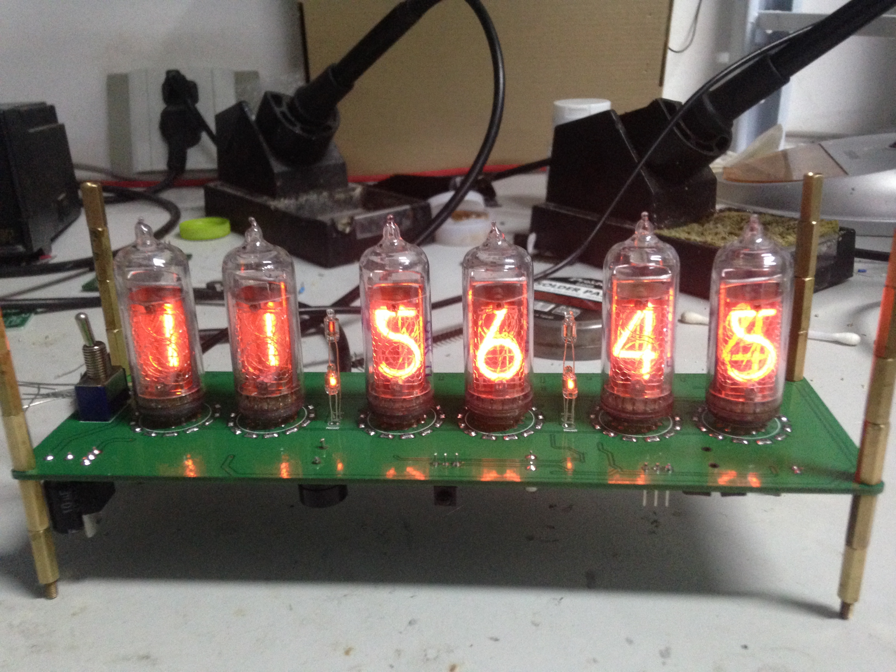
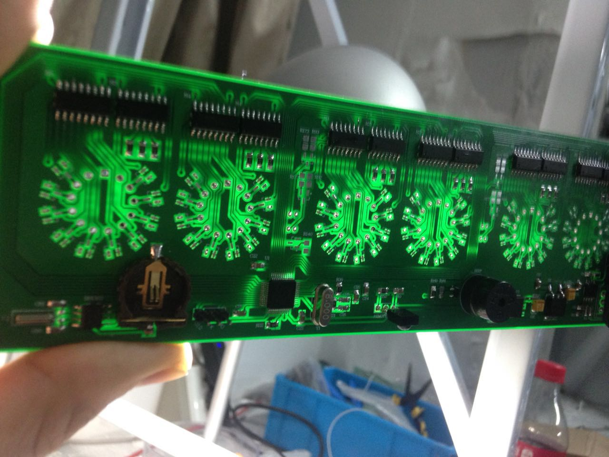
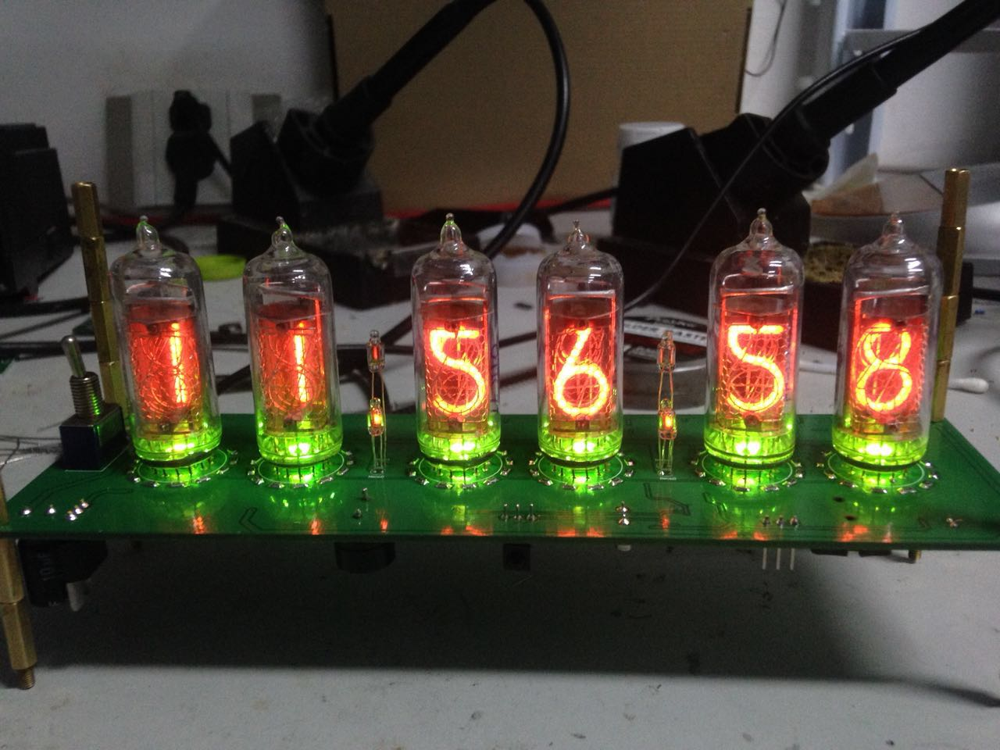
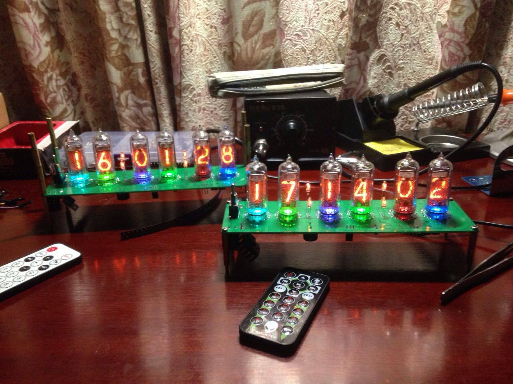

This is the Nixie Clock based on STM32.

## For the hardware
The Schematic diagram and PCB are in the folder "/PCB".  
There are many versions in this folder since I didn't delete the early version.
The final version is "/PCB/NIXIE_clock.PcbLib"

## For the software
all the code in the repo.

### Some images
 

*the normal mode* 

 

*the circuit* 

 
 

if you have some questions or good ideas
feel free communicate with me  

email: fmo6@ucsc.edu
